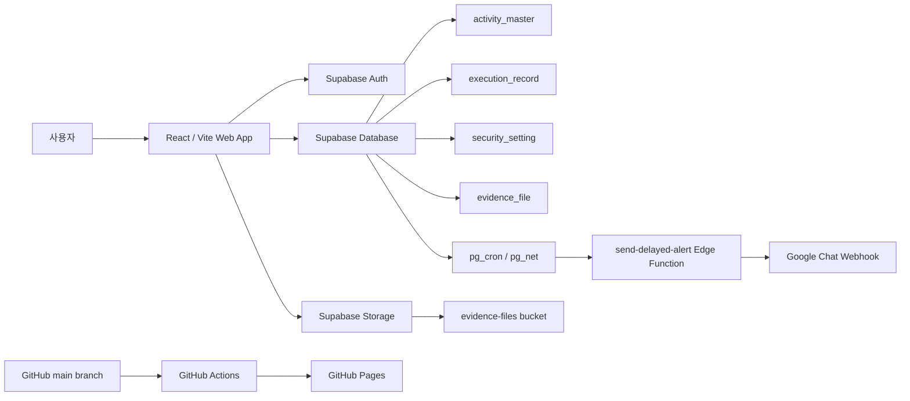

# Security Activity Monitoring System

보안 활동 모니터링 시스템은 조직의 정보보호 활동을 등록하고, 주기별 수행
일정을 자동 생성하며, 수행 현황과 증적 파일을 관리하고, PDF 리포트를 생성하는
웹 기반 관리 시스템입니다.

이 저장소는 React/Vite 프론트엔드와 Supabase 백엔드 구성을 포함합니다. 정적
웹 앱은 GitHub Pages로 배포되며, 배포 자동화는 저장소의 GitHub Actions
workflow가 담당합니다.

## 서비스 주소

https://sanghakbae.github.io/security-activity-monitoring-system/

## 주요 기능

### 보안 활동 목록 관리

보안 활동의 기준 정보를 등록하고 수정합니다.

- 보안 활동명
- 담당 부서
- 협업 부서
- 수행 주기: 수시, 월간, 분기, 반기, 연 1회
- 활동 목적
- 수행 가이드
- 필수 증적 목록

활동을 저장하면 수행 주기에 따라 전년도, 현재년도, 다음년도 범위의 수행
레코드가 생성 또는 동기화됩니다.

### 수행 및 증적 관리

생성된 수행 레코드별로 실제 수행 내역을 기록하고 증적을 업로드합니다.

- 수행 상태: 예약, 완료, 지연
- 수행 기한
- 수행 메모
- 증적 파일 업로드
- 업로드된 증적 파일 썸네일 표시

수행 기한이 지난 월의 미완료 항목은 지연 상태로 계산 및 동기화됩니다.

### 대시보드

보안 활동의 전체 현황을 한 화면에서 확인합니다.

- 전체 수행 건수
- 이번 달 수행 건수
- 완료 건수
- 지연 건수
- 완료율
- 월별/상태별 활동 확인

### 보안 설정

운영 중 변경이 필요한 보안 설정을 화면에서 관리합니다.

- 허용 이메일 도메인
- 세션 유지 시간
- Google Chat 지연 알림 발송 시각

허용 이메일 도메인은 쉼표로 여러 개 입력할 수 있습니다.

### 인증

Supabase Auth의 Google OAuth를 사용합니다.

- Google 계정으로 로그인
- 허용 도메인 기반 접근 제한
- 설정된 세션 유지 시간 초과 시 로그아웃 처리
- 개발/테스트용 mock auth 모드 지원

### 지연 활동 알림

기한이 지난 보안 활동이 있으면 Google Chat으로 알림을 전송합니다.

- Supabase Edge Function: `send-delayed-alert`
- Supabase DB cron: 5분 주기로 Edge Function 호출
- 앱의 보안 설정에 저장된 발송 시각과 일치할 때만 실제 발송
- Asia/Seoul 기준 주말과 대한민국 공휴일에는 발송하지 않음
- GitHub Actions 수동 실행 workflow로 테스트 가능

### PDF 리포트

보안 활동 수행 결과를 PDF로 생성합니다.

- 분기 리포트
- 반기 리포트
- 연간 리포트
- 수행 상태, 기한, 메모, 증적 썸네일 포함
- 한글 폰트 포함

## 기술 스택

### Frontend

- React 18
- TypeScript
- Vite
- Tailwind CSS
- React Router
- Lucide React

### Backend / Platform

- Supabase Auth
- Supabase Database
- Supabase Storage
- Supabase Edge Functions
- PostgreSQL
- pg_cron
- pg_net

### Reporting

- jsPDF
- jspdf-autotable
- pdf-lib
- html2canvas

### Deployment

- GitHub Pages
- GitHub Actions

## 시스템 아키텍처



## 프로젝트 구조

```text
.
├── .github/workflows
│   ├── deploy.yml
│   └── delayed-alert.yml
├── public
│   ├── 404.html
│   └── fonts
├── src
│   ├── app
│   ├── auth
│   ├── components
│   ├── hooks
│   ├── lib
│   ├── pages
│   ├── types
│   └── utils
├── supabase
│   ├── config.toml
│   ├── functions
│   └── migrations
├── index.html
├── vite.config.ts
├── package.json
└── README.md
```

## 로컬 실행

### 1. 저장소 클론

```bash
git clone https://github.com/sanghakbae/security-activity-monitoring-system.git
cd security-activity-monitoring-system
```

### 2. 패키지 설치

```bash
npm install
```

### 3. 환경 변수 설정

프로젝트 루트에 `.env` 파일을 생성합니다.

```env
VITE_SUPABASE_URL=your_supabase_project_url
VITE_SUPABASE_ANON_KEY=your_supabase_anon_key
```

선택 환경 변수:

```env
VITE_AUTH_MODE=supabase
VITE_ALLOWED_DOMAIN=muhayu.com
```

`VITE_AUTH_MODE=mock`으로 설정하면 Supabase 로그인 없이 개발용 mock 계정으로
동작합니다.

### 4. 개발 서버 실행

```bash
npm run dev
```

### 5. 프로덕션 빌드 확인

```bash
npm run build
```

## Supabase 설정

### 데이터베이스 마이그레이션

`supabase/migrations` 디렉터리의 SQL 파일을 순서대로 적용합니다.

```text
001_initial_schema.sql
002_sync_execution_record.sql
003_security_policies_and_delayed_sync.sql
004_security_settings.sql
005_supabase_cron_delayed_alert.sql
006_fix_evidence_file_rls.sql
007_fix_evidence_upload_rls_storage.sql
```

### Storage

증적 파일은 Supabase Storage의 `evidence-files` bucket을 사용합니다.

관련 RLS 및 업로드 정책은 마이그레이션 파일에 포함되어 있습니다.

### Edge Function

지연 알림 함수 위치:

```text
supabase/functions/send-delayed-alert/index.ts
```

함수 설정:

```toml
[functions.send-delayed-alert]
verify_jwt = false
```

배포 예시:

```bash
supabase functions deploy send-delayed-alert
```

Supabase 프로젝트에는 다음 환경 변수가 필요합니다.

```text
SUPABASE_URL
SUPABASE_SERVICE_ROLE_KEY
GOOGLE_CHAT_WEBHOOK_URL
```

## 지연 알림 동작 방식

지연 알림은 두 가지 경로로 실행할 수 있습니다.

### Supabase cron 자동 실행

`005_supabase_cron_delayed_alert.sql`은 `pg_cron`과 `pg_net`을 사용해
`send-delayed-alert-every-5m` 작업을 생성합니다.

cron은 5분마다 Edge Function을 호출하지만, 함수 내부에서 아래 조건을 확인한
뒤 실제 Google Chat 메시지를 보냅니다.

- Asia/Seoul 기준 평일
- 대한민국 공휴일 아님
- 현재 시각이 `security_setting.google_chat_alert_times`에 포함됨
- 지연된 수행 레코드가 존재함

### GitHub Actions 수동 실행

`.github/workflows/delayed-alert.yml`은 `workflow_dispatch` 방식의 수동 실행
workflow입니다.

GitHub 저장소의 Actions 탭에서 `Send Delayed Alert` workflow를 선택한 뒤
`Run workflow`로 실행할 수 있습니다. `force_send=true` 입력값을 사용하면 시간
조건을 무시하고 즉시 테스트할 수 있습니다.

이 workflow는 배포용 workflow가 아니라 지연 알림 함수 호출을 수동으로 검증하기
위한 보조 workflow입니다.

## GitHub Pages 배포

이 프로젝트의 정적 웹 앱 배포는 `.github/workflows/deploy.yml`에 정의되어
있습니다. 사용자가 로컬에서 GitHub Actions 설정을 별도로 수정하지 않아도,
저장소에 포함된 workflow가 `main` 브랜치 push를 감지해 자동 배포합니다.

### 배포 트리거

```yaml
on:
  push:
    branches: [ main ]
```

즉, 아래 명령으로 `main` 브랜치에 커밋을 push하면 GitHub Actions가 실행됩니다.

```bash
git push origin main
```

### 배포 workflow가 하는 일

`.github/workflows/deploy.yml`의 주요 단계는 다음과 같습니다.

1. 저장소 코드를 checkout합니다.
2. Node.js 20을 설정합니다.
3. `npm install`로 의존성을 설치합니다.
4. `npm run build`로 Vite 정적 파일을 생성합니다.
5. `dist` 디렉터리를 GitHub Pages artifact로 업로드합니다.
6. `actions/deploy-pages@v4`로 GitHub Pages에 배포합니다.

### GitHub Secrets

배포 workflow의 빌드 단계는 아래 GitHub Secrets를 사용합니다.

```text
VITE_SUPABASE_URL
VITE_SUPABASE_ANON_KEY
```

GitHub 저장소에서 `Settings > Secrets and variables > Actions`에 위 값을
등록해야 GitHub Actions 빌드 결과물이 Supabase 프로젝트에 연결됩니다.

### Vite base 경로

GitHub Pages는 `/security-activity-monitoring-system/` 하위 경로에서 앱을
서비스합니다. `vite.config.ts`는 GitHub Actions 환경에서만 base 경로를 저장소
이름으로 설정합니다.

```ts
base: process.env.GITHUB_ACTIONS ? '/security-activity-monitoring-system/' : '/'
```

그래서 로컬 개발 서버는 `/` 기준으로 동작하고, GitHub Actions 배포 빌드는
GitHub Pages 하위 경로 기준으로 동작합니다.

### SPA 새로고침 대응

GitHub Pages는 SPA 라우팅을 직접 알지 못합니다. 이 저장소는 `public/404.html`과
`index.html`의 복원 스크립트를 사용해 `/login`, `/auth/callback` 같은 라우트를
새로고침해도 앱이 올바르게 열리도록 처리합니다.

## 운영 체크리스트

배포 또는 설정 변경 후 아래 항목을 확인합니다.

- GitHub Actions의 `Deploy to GitHub Pages` workflow가 성공했는지 확인
- GitHub Pages 서비스 주소 접속 확인
- Google OAuth 로그인 확인
- 허용 이메일 도메인 설정 확인
- 증적 파일 업로드 및 썸네일 표시 확인
- PDF 리포트 생성 확인
- `send-delayed-alert` Edge Function 수동 호출 확인
- Google Chat Webhook 수신 확인

## 유용한 명령어

```bash
# 개발 서버
npm run dev

# 타입 체크 및 프로덕션 빌드
npm run build

# GitHub Pages 배포 트리거
git push origin main

# Supabase Edge Function 배포
supabase functions deploy send-delayed-alert
```

## 참고 사항

- 이 저장소는 GitHub Pages 배포를 전제로 Vite base 경로를 설정합니다.
- GitHub Actions workflow 파일은 저장소에 포함되어 있으므로, 일반적인 코드
  수정 후에는 커밋을 `main`에 push하는 것만으로 배포가 시작됩니다.
- 지연 알림의 자동 실행은 GitHub Actions 배포와 별개입니다. 실제 정기 실행은
  Supabase cron이 담당하고, GitHub Actions의 `Send Delayed Alert`는 수동 검증
  용도입니다.
- 운영 dependency 중 `jspdf@2.5.2`가 취약한 `dompurify` 버전을 포함한다는
  `npm audit` 경고가 있습니다. `jspdf` 주요 버전 업그레이드는 PDF 출력 회귀
  확인과 함께 별도 작업으로 처리하는 것이 좋습니다.
