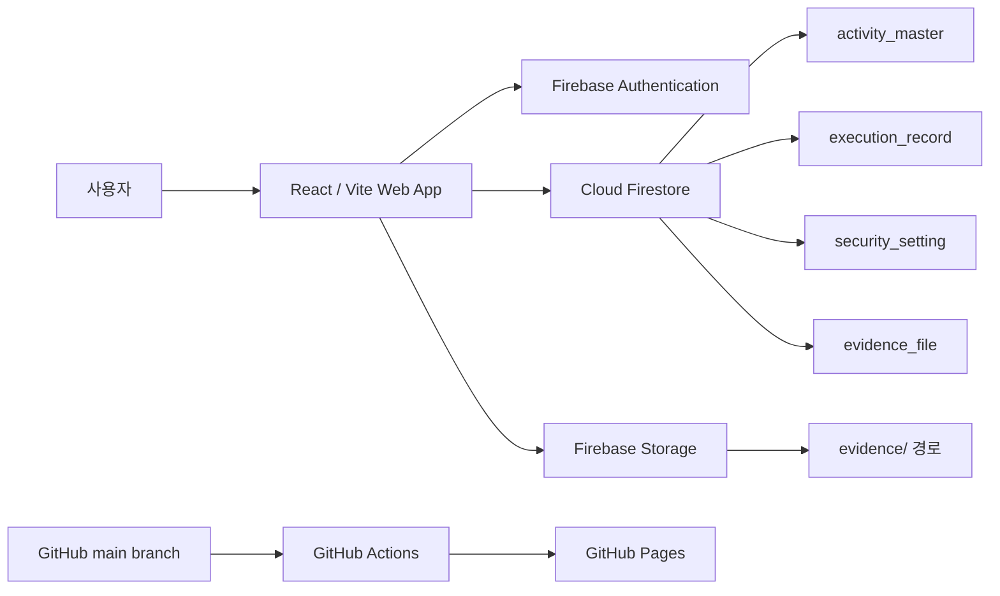

# Security Activity Monitoring System

보안 활동 모니터링 시스템은 조직의 정보보호 활동을 등록하고, 주기별 수행
일정을 자동 생성하며, 수행 현황과 증적 파일을 관리하고, PDF 리포트를 생성하는
웹 기반 관리 시스템입니다.

이 저장소는 React/Vite 프론트엔드와 Firebase 백엔드 구성을 포함합니다. 정적
웹 앱은 GitHub Pages로 배포되며, 배포 자동화는 저장소의 GitHub Actions
workflow가 담당합니다.

## 서비스 주소

https://sanghakbae.github.io/security-activity-monitoring-system/

## 주요 기능

### 보안 활동 목록 관리

보안 활동의 기준 정보를 등록하고 수정합니다.

- 보안 활동명
- 담당 부서
- 협업 부서
- 수행 주기: 수시, 월간, 분기, 반기, 연 1회
- 활동 목적
- 수행 가이드
- 필수 증적 목록

활동을 저장하면 수행 주기에 따라 전년도, 현재년도, 다음년도 범위의 수행
레코드가 생성 또는 동기화됩니다.

### 수행 및 증적 관리

생성된 수행 레코드별로 실제 수행 내역을 기록하고 증적을 업로드합니다.

- 수행 상태: 예약, 완료, 지연
- 수행 기한
- 수행 메모
- 증적 파일 업로드
- 업로드된 증적 파일 썸네일 표시

수행 기한이 지난 월의 미완료 항목은 지연 상태로 계산 및 동기화됩니다.

### 대시보드

보안 활동의 전체 현황을 한 화면에서 확인합니다.

- 전체 수행 건수
- 이번 달 수행 건수
- 완료 건수
- 지연 건수
- 완료율
- 월별/상태별 활동 확인

### 보안 설정

운영 중 변경이 필요한 보안 설정을 화면에서 관리합니다.

- 허용 이메일 도메인
- 세션 유지 시간
- Google Chat 지연 알림 발송 시각

허용 이메일 도메인은 쉼표로 여러 개 입력할 수 있습니다.

### 인증

Firebase Authentication의 Google 로그인을 사용합니다.

- Google 계정으로 로그인 (리디렉트 방식, `/auth/callback`)
- 허용 도메인 기반 접근 제한 (클라이언트 검증)
- 설정된 세션 유지 시간 초과 시 로그아웃 처리
- 개발/테스트용 mock auth 모드 지원

### 지연 활동 상태 확인

기한이 지난 보안 활동은 앱 화면에서 지연 상태로 확인할 수 있습니다.

- 대시보드 지연 건수 표시
- 수행 목록 지연 필터
- PDF 리포트의 미완료/지연 건수 표시
- Google Chat 자동 알림은 현재 비활성화됨

### PDF 리포트

보안 활동 수행 결과를 PDF로 생성합니다.

- 분기 리포트
- 반기 리포트
- 연간 리포트
- 수행 상태, 기한, 메모, 증적 썸네일 포함
- 한글 폰트 포함

## 기술 스택

### Frontend

- React 18
- TypeScript
- Vite
- Tailwind CSS
- React Router
- Lucide React

### Backend / Platform

- Firebase Authentication (Google)
- Cloud Firestore
- Firebase Storage
- Firebase Security Rules
- Firebase Hosting (선택)

### Reporting

- jsPDF
- jspdf-autotable
- pdf-lib
- html2canvas

### Deployment

- GitHub Pages
- GitHub Actions

## 시스템 아키텍처


```mermaid
flowchart LR
  User["사용자"] --> WebApp["React / Vite Web App"]
  WebApp --> Auth["Firebase Authentication"]
  WebApp --> DB["Cloud Firestore"]
  WebApp --> Storage["Firebase Storage"]

  DB --> ActivityMaster["activity_master"]
  DB --> ExecutionRecord["execution_record"]
  DB --> SecuritySetting["security_setting"]
  DB --> EvidenceFile["evidence_file"]

  Storage --> EvidenceStorage["evidence/ 경로"]

  GitHub["GitHub main branch"] --> Actions["GitHub Actions"]
  Actions --> Pages["GitHub Pages"]
```

## 프로젝트 구조

```text
.
├── .github/workflows
│   └── deploy.yml
├── public
│   ├── 404.html
│   └── fonts
├── src
│   ├── app
│   ├── auth
│   ├── components
│   ├── hooks
│   ├── lib
│   ├── pages
│   ├── types
│   └── utils
├── scripts
│   └── seed-firestore.mjs
├── firebase.json
├── firestore.rules
├── firestore.indexes.json
├── storage.rules
├── index.html
├── vite.config.ts
├── package.json
└── README.md
```

## 로컬 실행

### 1. 저장소 클론

```bash
git clone https://github.com/sanghakbae/security-activity-monitoring-system.git
cd security-activity-monitoring-system
```

### 2. 패키지 설치

```bash
npm install
```

### 3. 환경 변수 설정

프로젝트 루트에 `.env` 파일을 생성합니다.

```env
VITE_FIREBASE_API_KEY=your_api_key
VITE_FIREBASE_AUTH_DOMAIN=your_project.firebaseapp.com
VITE_FIREBASE_PROJECT_ID=your_project_id
VITE_FIREBASE_STORAGE_BUCKET=your_project.appspot.com
VITE_FIREBASE_MESSAGING_SENDER_ID=your_sender_id
VITE_FIREBASE_APP_ID=your_app_id
```

위 값은 Firebase Console의 `프로젝트 설정 > 일반 > 내 앱 > SDK 설정 및 구성`에서
확인할 수 있습니다.

선택 환경 변수:

```env
VITE_AUTH_MODE=firebase
VITE_ALLOWED_DOMAIN=muhayu.com
```

`VITE_AUTH_MODE=mock`으로 설정하면 Firebase 로그인 없이 개발용 mock 계정으로
동작합니다.

### 4. 개발 서버 실행

```bash
npm run dev
```

### 5. 프로덕션 빌드 확인

```bash
npm run build
```

## Firebase 설정

### 1. 프로젝트 생성

Firebase Console에서 프로젝트를 생성하고 웹 앱을 등록합니다. 등록 시 표시되는
SDK 설정 값을 `.env`에 입력합니다(`.env.example` 참고).

### 2. Authentication

- Authentication > Sign-in method에서 **Google** 공급자를 활성화합니다.
- Authentication > Settings > 승인된 도메인에 GitHub Pages 도메인
  (`sanghakbae.github.io`)과 로컬 개발 도메인(`localhost`)을 추가합니다.
- 도메인 제한(`hd`)과 세션 유지 시간은 클라이언트(`src/auth/auth.ts`)에서
  `security_setting` 값으로 검증합니다.

### 3. Firestore

다음 컬렉션을 사용합니다(문서 ID는 자동 생성).

```text
activity_master    보안 활동 기준 정보
execution_record   주기별 수행 레코드
evidence_file      증적 파일 메타데이터
security_setting   허용 도메인 / 세션 시간 / 알림 시각
```

보안 규칙은 `firestore.rules`, 복합 색인은 `firestore.indexes.json`에 정의되어
있습니다. 인증된 사용자에게 전체 읽기/쓰기를 허용하며, 도메인 제한은
클라이언트에서 처리합니다.

### 4. Storage

증적 파일은 Firebase Storage의 `evidence/{executionRecordId}/...` 경로에
저장합니다. 접근 규칙은 `storage.rules`에 정의되어 있습니다.

### 5. 규칙 및 색인 배포

Firebase CLI(`npm i -g firebase-tools`)로 배포합니다.

```bash
firebase login
firebase use your_project_id
firebase deploy --only firestore:rules,firestore:indexes,storage
```

### 6. 초기 데이터 시드

`scripts/seed-firestore.mjs`가 기본 보안 활동 5건과 기본 보안 설정을 생성합니다.
서비스 계정 키(프로젝트 설정 > 서비스 계정 > 새 비공개 키 생성)가 필요합니다.

```bash
npm install   # firebase-admin(devDependency) 설치
export FIREBASE_SERVICE_ACCOUNT=/absolute/path/to/serviceAccount.json
npm run seed
```

## GitHub Pages 배포

이 프로젝트의 정적 웹 앱 배포는 `.github/workflows/deploy.yml`에 정의되어
있습니다. 사용자가 로컬에서 GitHub Actions 설정을 별도로 수정하지 않아도,
저장소에 포함된 workflow가 `main` 브랜치 push를 감지해 자동 배포합니다.

### 배포 트리거

```yaml
on:
  push:
    branches: [ main ]
```

즉, 아래 명령으로 `main` 브랜치에 커밋을 push하면 GitHub Actions가 실행됩니다.

```bash
git push origin main
```

### 배포 workflow가 하는 일

`.github/workflows/deploy.yml`의 주요 단계는 다음과 같습니다.

1. 저장소 코드를 checkout합니다.
2. Node.js 20을 설정합니다.
3. `npm install`로 의존성을 설치합니다.
4. `npm run build`로 Vite 정적 파일을 생성합니다.
5. `dist` 디렉터리를 GitHub Pages artifact로 업로드합니다.
6. `actions/deploy-pages@v4`로 GitHub Pages에 배포합니다.

### GitHub Secrets

배포 workflow의 빌드 단계는 아래 GitHub Secrets를 사용합니다.

```text
VITE_FIREBASE_API_KEY
VITE_FIREBASE_AUTH_DOMAIN
VITE_FIREBASE_PROJECT_ID
VITE_FIREBASE_STORAGE_BUCKET
VITE_FIREBASE_MESSAGING_SENDER_ID
VITE_FIREBASE_APP_ID
```

GitHub 저장소에서 `Settings > Secrets and variables > Actions`에 위 값을
등록해야 GitHub Actions 빌드 결과물이 Firebase 프로젝트에 연결됩니다.

### Vite base 경로

GitHub Pages는 `/security-activity-monitoring-system/` 하위 경로에서 앱을
서비스합니다. `vite.config.ts`는 GitHub Actions 환경에서만 base 경로를 저장소
이름으로 설정합니다.

```ts
base: process.env.GITHUB_ACTIONS ? '/security-activity-monitoring-system/' : '/'
```

그래서 로컬 개발 서버는 `/` 기준으로 동작하고, GitHub Actions 배포 빌드는
GitHub Pages 하위 경로 기준으로 동작합니다.

### SPA 새로고침 대응

GitHub Pages는 SPA 라우팅을 직접 알지 못합니다. 이 저장소는 `public/404.html`과
`index.html`의 복원 스크립트를 사용해 `/login`, `/auth/callback` 같은 라우트를
새로고침해도 앱이 올바르게 열리도록 처리합니다.

## 운영 체크리스트

배포 또는 설정 변경 후 아래 항목을 확인합니다.

- GitHub Actions의 `Deploy to GitHub Pages` workflow가 성공했는지 확인
- GitHub Pages 서비스 주소 접속 확인
- Google OAuth 로그인 확인
- 허용 이메일 도메인 설정 확인
- 증적 파일 업로드 및 썸네일 표시 확인
- PDF 리포트 생성 확인
- Firestore 보안 규칙 / Storage 규칙이 배포되었는지 확인
- Firebase Authentication 승인된 도메인에 배포 도메인이 등록되어 있는지 확인

## 유용한 명령어

```bash
# 개발 서버
npm run dev

# 타입 체크 및 프로덕션 빌드
npm run build

# GitHub Pages 배포 트리거
git push origin main

# Firestore / Storage 규칙·색인 배포
firebase deploy --only firestore:rules,firestore:indexes,storage

# 초기 데이터 시드
npm run seed
```

## 참고 사항

- 이 저장소는 GitHub Pages 배포를 전제로 Vite base 경로를 설정합니다.
- GitHub Actions workflow 파일은 저장소에 포함되어 있으므로, 일반적인 코드
  수정 후에는 커밋을 `main`에 push하는 것만으로 배포가 시작됩니다.
- 지연 상태는 앱 로드 시 클라이언트에서 계산·동기화합니다. 기존 Supabase의
  Google Chat 자동 알림(pg_cron / Edge Function)은 이전 과정에서 제거되었습니다.
- 백엔드 인프라는 Supabase(PostgreSQL)에서 Firebase(Firestore / Auth / Storage)로
  이전되었습니다. 기존 `supabase/` 디렉터리는 참고용 레거시로 남아 있습니다.
- 운영 dependency 중 `jspdf@2.5.2`가 취약한 `dompurify` 버전을 포함한다는
  `npm audit` 경고가 있습니다. `jspdf` 주요 버전 업그레이드는 PDF 출력 회귀
  확인과 함께 별도 작업으로 처리하는 것이 좋습니다.
